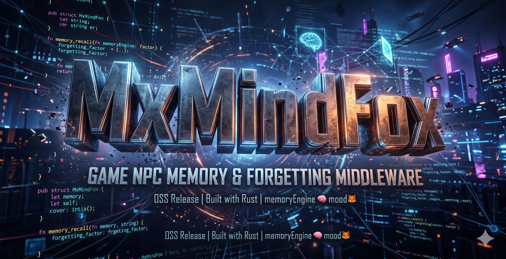

# MindFox



**Your NPCs remember. Your NPCs forget. No cloud required.**

MxMindFox is an offline-first memory middleware for game NPCs and autonomous agents.
Instead of shipping a 400 MB embedding model, it uses **GM-defined 16-byte factor vectors** — scored by a lightweight LLM at runtime, or even by pure game logic.

SQLite is the only dependency. One binary. Works on PC, console, mobile, and your CI server.

---

## Why MindFox?

Most NPC memory solutions require cloud APIs, heavyweight ML models, or always-on network access. MxMindFox takes a different approach:

| | Cloud NPC services | MxMindFox |
|---|---|---|
| Network | Required | **Not needed** |
| Memory backend | Proprietary vector DB | **SQLite (bundled)** |
| Vector size | 1024+ floats (4 KB+) | **16 bytes** |
| External models | ONNX / API calls | **None** (factor vectors are game-defined) |
| Forgetting | Not supported | **Built-in** (price × half-life decay) |
| Access control | Per-agent API keys | **UNIX-style rwx** per memory cell |
| Shipping | SDK + cloud account | **Single static library** |

## Architecture

```
┌──────────────────────────────────────────────┐
│  Your Game (Unity / Unreal / Godot / CLI)    │
│  Turn loop · LLM calls · UI                  │
├──────────────────────────────────────────────┤
│  MxMindFox (crate)      ~800 lines Rust      │
│  Mood · Decision · Diplomacy · Threshold     │
│  C API (cdylib) + Python ctypes bridge       │
├──────────────────────────────────────────────┤
│  MxBS                   ~3100 lines Rust     │
│  Memory engine (deterministic, fast)         │
│  store · search · dream · reinforce · inspire│
│  + ChatterFox (cascade) · YamAMVA (state)    │
│  C API (cdylib) + Python ctypes bridge       │
├──────────────────────────────────────────────┤
│  SQLite (bundled via rusqlite)               │
└──────────────────────────────────────────────┘
```

**MxBS** is the memory engine — deterministic, fast, no randomness.
**MxMindFox** adds mood, probabilistic decisions, and diplomacy on top — all the "messy human" parts.

You can use MxBS alone if you just need NPC memory. Add MxMindFox when you want agents that *feel*. Together, they form **MindFox**.

## Crates

| Crate | Version | Description |
|---|---|---|
| [**mxbs**](mxbs/) | 0.4.0 | Factor-vector memory engine. Store, search, forget, dream. Cascade search (ChatterFox) + game state (YamAMVA). |
| [**mxmindfox**](mxmindfox/) | 0.1.1 | Multi-agent mood, decision, diplomacy layer on MxBS. |

## Quick Start — MxBS

```rust
use mxbs::{MxBS, MxBSConfig, AgentRegistry};

// Open database (in-memory for testing, file path for production)
let mxbs = MxBS::open(":memory:", MxBSConfig::default())?;

// Register agents
let mut reg = AgentRegistry::new();
reg.register("npc_a", "Blacksmith")?;
reg.register("npc_b", "Mayor")?;

// Store a public memory (all agents can see)
let features = [180, 200, 50, 220, 100, 80, 160, 190, 140, 70, 200, 130, 80, 170, 110, 150];
reg.store_public(&mxbs, 1, "npc_a", "Argued with the Mayor about taxes", features, 90)?;

// Store a private memory (only npc_a can see)
reg.store_private(&mxbs, 1, "npc_a", "I think the Mayor is hiding something", features, 120)?;

// Search from an agent's perspective (respects ACL + decay)
let results = reg.search(&mxbs, "npc_a", features, 5)?;

// Dream: surface buried but important memories
let dreams = reg.dream(&mxbs, "npc_a", 3)?;
```

## Quick Start — MxMindFox

```rust
use mxmindfox::{Mood, MoodPreset, ThresholdRule};
use mxmindfox::decision;

// Load a game-specific mood preset
let preset = MoodPreset::from_json(include_str!("mood_preset.json"))?;

// Compute mood from recent memory cells
let mood = mxmindfox::compute_mood(&preset, &recent_cells, Some("warrior"))?;

// Adjust a threshold based on mood (e.g., attack willingness)
let rule = ThresholdRule::new("aggression", 0.2, -0.1);
let adjusted = mxmindfox::adjust_threshold(0.5, &mood, &[rule]);

// Probabilistic decision with temperature (Bernoulli + sigmoid)
let attacks = decision::remember(score, adjusted, mood.get_or("temperature", 0.0), seed);

// Or sample from multiple options (Multinomial + softmax)
let chosen = decision::sample(&scores, temperature, seed);
```

## Key Concepts

### Factor Vectors

Every memory cell has a 16-byte vector `[u8; 16]`. Each byte represents a GM-defined axis — "aggression", "trust", "urgency", whatever your game needs. A heavy LLM designs the axes (design-time); a lightweight LLM scores new text against them (runtime). Or skip the LLM entirely and use game logic.

### Forgetting

Memories have a `price` (0–255) and decay over turns with a configurable `half_life`. Cheap memories fade fast. Expensive ones persist. Immortal memories (`price = 255`) never decay. This means NPCs naturally forget old gossip but remember traumatic events.

### Dreams

`dream()` surfaces memories that are *important but buried* — high price, low recent relevance. Think of it as an NPC suddenly remembering something from their past when the context shifts.

### Access Control

Every cell has UNIX-style `owner / group / other` permissions and a `group_bits` mask. An NPC's private thoughts (`mode = 0o700`) are invisible to others. Public announcements (`mode = 0o744`) are visible to everyone. Secrets shared between two NPCs use targeted group bits.

### Mood (MxMindFox)

Mood is computed from recent memories, driven by a JSON preset. The preset defines axes ("aggression", "trust", "anxiety") and maps MxBS factor indices to them. Different archetypes have different baselines — a "warrior" starts more aggressive, a "diplomat" starts more trusting.

### Decisions (MxMindFox)

Two models, both temperature-controlled:
- **`remember`**: Should this memory trigger an action? (Bernoulli / sigmoid)
- **`sample`**: Which option should the agent pick? (Multinomial / softmax)

## Language Bindings

| Language | Mechanism | Status |
|---|---|---|
| **Rust** | Native crate | ✅ Stable |
| **C / C++** | `cdylib` extern functions | ✅ MxBS: 30 functions, MxMindFox: 9 functions |
| **Python** | ctypes bridge | ✅ `mxbs_bridge.py` + `mxmindfox_bridge.py` |
| **C# (Unity)** | P/Invoke over C API | 🔜 Planned |
| **GDScript (Godot)** | GDExtension / C API | 🔜 Planned |

## Demos

Four demos ship with the workspace, each proving a different capability:

| Demo | LLM | What it proves |
|------|-----|----------------|
| [**sengoku**](demos/sengoku/) | gemma4:e2b | Warlord SIM — mood-based attack thresholds, rule-based scoring |
| [**oyatsu**](demos/oyatsu/) | gemma4:26b | Social deduction — 7 characters, cross-game memory, diplomacy |
| [**oyatsu_chatterfox**](demos/oyatsu_chatterfox/) | None | Detective game — cascade search (ChatterFox) + YamAMVA state, 6 NPC × 51 lines, YAML-driven |
| [**pageone**](demos/pageone/) | None | Card game — quantitative decay test, 50 games in <1 second |

The **pageone** demo is the best starting point — it runs with zero external dependencies and demonstrates that MxBS's forgetting + reinforce alone can create distinct character personalities.

## See Also

### [MindFoxLite](https://github.com/kikyujin/MindFoxLite)

Python single-file multi-agent story generator. No Rust, no build step — just `python mindfoxlite.py`.
Uses Ollama + gemma4:26b locally. Good starting point if you want to experiment with multi-agent narratives before integrating MindFox into your game.

Includes two complete scenarios not available in MindFox:

| Scenario | Setting | Agents |
|---|---|---|
| **hawaii2035** | Near-future Hawaii geopolitical simulation | 6 agents, inner_voice system |
| **mire_defense** | Korean corporate drama ("ミレ・ディフェンスの暗闘") | 8 agents, faction dynamics |

## Project Structure

```
MindFox/
├── Cargo.toml             # Workspace root
├── mxbs/                  # Memory engine crate
│   ├── Cargo.toml
│   ├── src/
│   │   ├── lib.rs         # Core: Cell, MxBS, search, dream, inspire
│   │   ├── agents.rs      # AgentRegistry helper
│   │   ├── preset.rs      # Preset loading + scoring prompts
│   │   ├── chatterfox.rs  # MxChatterFox: cosine cascade search
│   │   ├── yamamva.rs     # MxYamAMVA: game state management
│   │   └── ffi.rs         # C API (30 extern "C" functions)
│   └── python/
│       └── mxbs_bridge.py
├── mxmindfox/             # Mood / Decision / Diplomacy layer
│   ├── Cargo.toml
│   ├── src/
│   │   ├── lib.rs         # Public API re-exports
│   │   ├── mood.rs        # Mood, MoodPreset, compute_mood
│   │   ├── diplomacy.rs   # compute_diplomacy_toward
│   │   ├── threshold.rs   # ThresholdRule, adjust_threshold
│   │   ├── decision.rs    # remember (sigmoid), sample (softmax)
│   │   ├── error.rs       # MxmfError
│   │   └── ffi.rs         # C API (9 extern "C" functions)
│   └── python/
│       └── mxmindfox_bridge.py
├── demos/
│   ├── sengoku/           # Warlord SIM (Rust binary)
│   ├── oyatsu/            # Social deduction (Python + Ollama)
│   ├── oyatsu_chatterfox/ # Detective game (YAML + cascade search, no LLM)
│   └── pageone/           # Card game decay test (Python, no LLM)
└── docs/
    ├── mxbs_concept.md         # Why factor vectors beat embeddings
    ├── mxbs_spec.md            # MxBS full API specification
    ├── mxchatterfox_concept.md # MxChatterFox design and cascade search
    ├── mxchatterfox_api.md     # MxChatterFox C API reference
    ├── mxyamamva_concept.md    # MxYamAMVA design and state management
    ├── mxyamamva_api.md        # MxYamAMVA C API reference
    ├── mxmf_architecture.md    # MxMindFox architecture and specification
    ├── oyatsu_spec.md          # AI館おやつデモ game specification
    ├── oyatsu_chatterfox_spec.md # おやつ事件 MxChatterFox demo specification
    ├── pageone_spec.md         # Page One demo specification (decay test)
    └── sengoku_report.md       # Sengoku SIM demo technical report
```

## Performance

Measured on M4 Max Mac:

| Metric | Value |
|---|---|
| pageone: 50 games, 419 turns | < 1 second |
| sengoku: 1 turn (5 nations, rule-based scoring) | ~10 seconds |
| oyatsu: 1 turn (7 agents, gemma4:26b scoring) | ~120 seconds (LLM-bound) |
| Memory cell size | 16 bytes vector + metadata |
| Database per save slot | ~57 KB compressed (12 cells, 98%+ compression) |

## Building

```bash
# Build everything
cargo build --workspace

# Run all tests
cargo test --workspace

# Build C shared libraries
cargo build --workspace --release
# → target/release/libmxbs.dylib (or .so / .dll)
# → target/release/libmxmindfox.dylib (or .so / .dll)
```

## Tested With

| Component | Version |
|---|---|
| Rust | 2024 edition |
| SQLite | bundled via rusqlite |
| LLM (runtime scoring) | Ollama + gemma4:e2b / gemma4:26b |
| LLM (preset design) | Claude Opus |
| OS | macOS (M4 Max), Linux |

## License

MIT — See [LICENSE](LICENSE) for details.

If you ship a game using MindFox, we'd love a copy! Not a legal requirement — just a friendly request from the author. 🦊

Made with 🦊 by [MULTITAPPS Inc.](https://multitapps.com)
